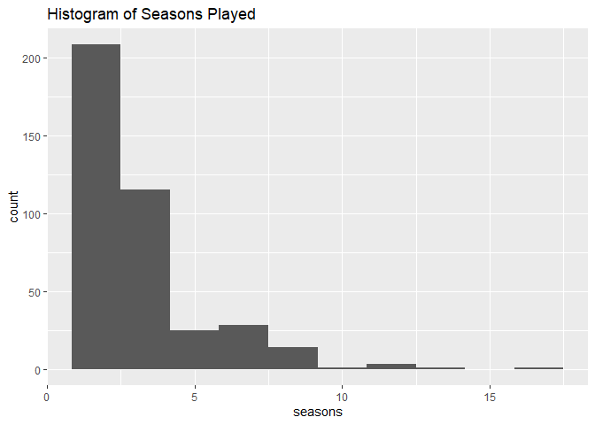
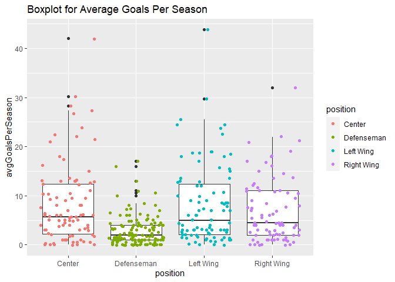
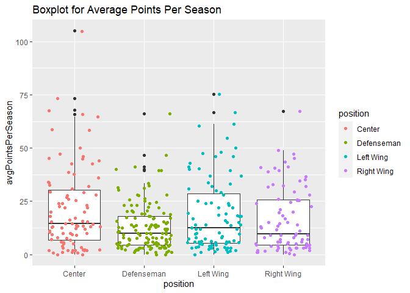
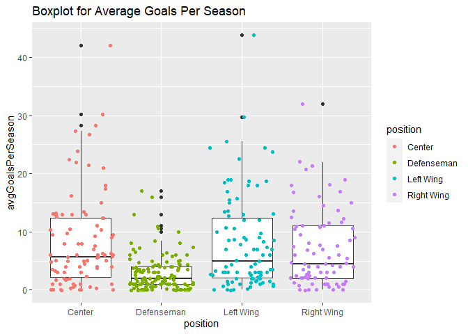
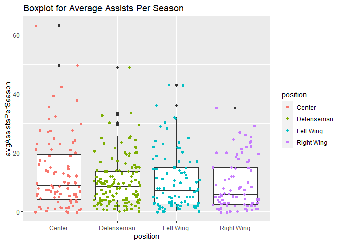
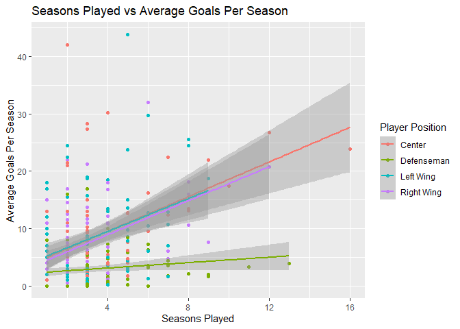
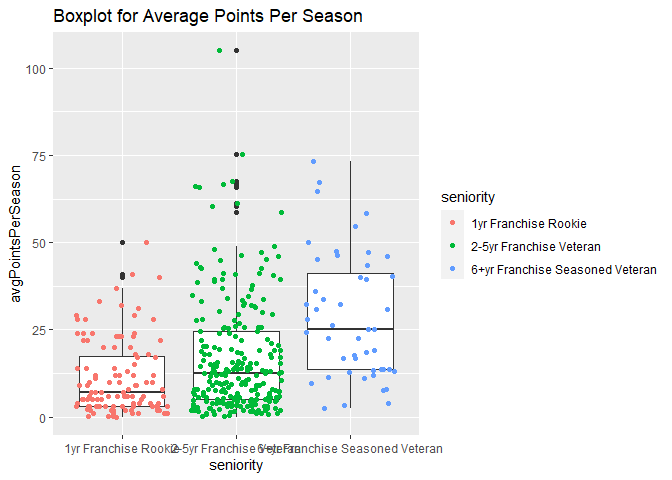
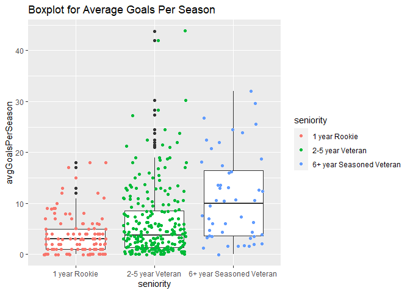
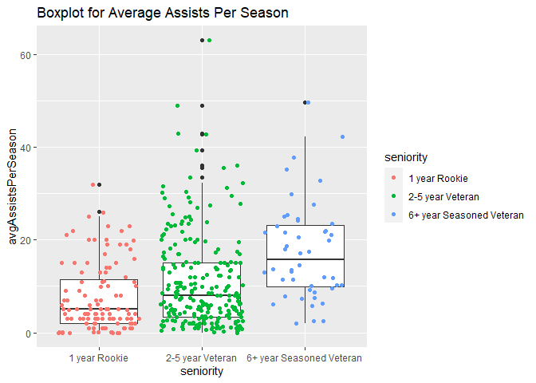
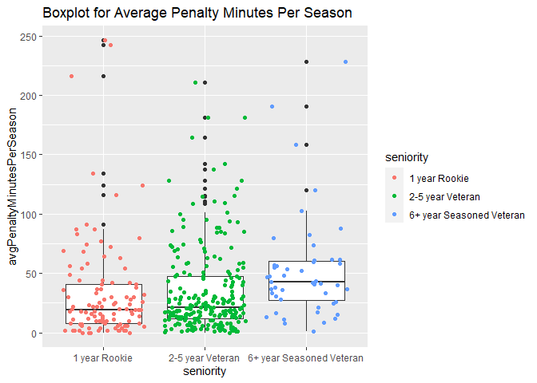

Project 1
================
Brian Sugg
6/12/2020

  - [Introduction to JSON Data](#introduction-to-json-data)
      - [Background](#background)
      - [Reading JSON DATA into R](#reading-json-data-into-r)
          - [Package 1 - rjson:](#package-1---rjson)
          - [Package 2 - RJSONIO:](#package-2---rjsonio)
          - [Package 3 - jsonlite:](#package-3---jsonlite)
      - [Package for this Vignette](#package-for-this-vignette)
  - [NHL Franchise API](#nhl-franchise-api)
      - [Background](#background-1)
      - [Establishing API Connection](#establishing-api-connection)
      - [Exploratory Data Analysis](#exploratory-data-analysis)
          - [The Data](#the-data)
          - [Numeric Summaries](#numeric-summaries)
          - [Visuals](#visuals)

# Introduction to JSON Data

## Background

JSON stands for JavaScript Object Notation and is simply a method for
writing out data objects using the JavaScript language for quick and
efficient transmission between servers and browsers. JavaScript is a
lightweight programming language with less syntax notation that makes it
easy to read, write, and store data. The lightweight structure of JSON
makes it a great way to quickly and efficiently send large amounts of
data with minimal wait time and storage size.

JSON is commonly used when creating and consuming data via API
connections. It can ingest text strings, numbers, boolean values, `null`
values, arrays, and objects into long strings of text that get delivered
to a client for processing. An example from the [Mozilla
Developers](https://developer.mozilla.org/en-US/docs/Learn/JavaScript/Objects/JSON)
webpage helps illustrate how data describing a superhero, “Molecule
Man”, would look in JavaScript format within a JSON file:

`{"name":"Molecule Man","age": 29,"secretIdentity":"Dan
Jukes","powers":["Radiation resistance","Turning tiny","Radiation
blast"]}`

This file can be received and unpackaged by a browser for parsing back
into a consumable format, such as:


More information on JSON including its history and usage can be found in
the [Wikipedia](https://en.wikipedia.org/wiki/JSON) community. The
following sections will look further into how JSON files can be
unpackaged and parsed into R, including an example connection to an API
for the National Hockey League (NHL).

## Reading JSON DATA into R

There are several packages available for reading JSON data into R. Some
of these packages, such as `rjson`, have been around for a few years
providing functionality as a predecessor for future packages to improve
upon. Three major packages will be discussed further below with links to
their respective documentation in the Comprehensive R Archive Network
(CRAN). They include:

  - `rjson`  
  - `RJSONIO`  
  - `jsonlite`

In the spirit of open source development, the evolution of other
packages for converting between JSON and R still continues today. This
is evident in the recent release version of the
[`tidyjson`](https://cran.r-project.org/package=tidyjson) package on
31-May-2020.

### Package 1 - rjson:

The `rjson` package was an early effort in converting data between JSON
and R. Its two primary functions are:

  - `toJSON()` for converting R objects to JSON format  
  - `fromJSON()` for converting from JSON format into R objects

In early release versions, `rjson` was reportedly too slow for
converting large R objects into JSON format. The need for a faster
conversion would eventually lead to the creation of the `RJSONIO`
package.

*[Link](https://cran.r-project.org/package=rjson) to CRAN documentation
for a more exhaustive list of `rjson` functions and their arguments.*

### Package 2 - RJSONIO:

Building upon the functionality of `rjson`, the `RJSONIO` package offers
faster conversions and additional functions for troubleshooting the
parsing process. Both `fromJSON()` and `toJSON()` are enhanced and still
available, and new functions introduced, such as:

  - `isValidJSON()` for validating JSON format prior to parsing, which
    helps when troublehsooting errors  
  - `readJSONStream()` that optimizes system memory and processing for
    the ingestion of streaming JSON content

Overall, `RJSONIO` has additional options for the generation and
processing of JSON content, while sharing a similar look and feel of
`rjson`.

*[Link](https://cran.r-project.org/package=RJSONIO) to CRAN
documentation for a more exhaustive list of `RJSONIO` functions and
their arguments.*

### Package 3 - jsonlite:

Originally a fork of the `RJSONIO` package, the `jsonlite` package is
one of the newer options available for parsing JSON data in R. It has
been designed and optimized for interaction with web APIs. The core
functions of `fromJSON()` and `toJSON()` remain, however, they have been
rewritten for better consistency when converting between JSON and R.
Other functions for `jsonlite` include:

  - `validate()` for validating the structure of JSON content (similar
    to `isValidJSON()` in `RJSONIO`)  
  - `prettify()` adds indentation to JSON strings for better
    readability  
  - `minify()` for removing all indendation and whitespace  
  - `stream_in()` and `stream_out()` for handling streaming JSON
    connections

Overall, `jsonlite` is a fast JSON parser and useful for the conversion
of JSON script into nested lists in R. Given its speed and high
performance, `jsonlite` is a powerful package for anyone interested in
JSON to R conversions, particularly when APIs are involved.

*[Link](https://cran.r-project.org/package=jsonlite) to CRAN
documentation for a more exhaustive list of `jsonlite` functions and
their arguments.*

## Package for this Vignette

Given its optimization for parsing JSON script from APIs, the `jsonlite`
package is used in this vignette when communicating with the API for NHL
records. Its fast speed and ease of use when coupled with the `httr`
package makes it a preferred candidate for converting JSON into R
objects.

In the following “NHL Franchise API” section, the `GET()` and
`content()` functions from `httr` will be used to call a URL and return
a JSON text string. The `fromJSON()` function from `jsonlite` will then
be utilized for parsing the raw text into a R list object. Finally, the
data table from the R list object will be pulled and converted into a
tibble for data analysis.

# NHL Franchise API

## Background

The professional hockey league across the United States and Canada is
the National Hockey League (NHL), which provides an API for public
consumption. The NHL offers almost no official documentation for this
connection and its available endpoints. To help navigate this API, open
source documentation from this
[GitLab](https://gitlab.com/dword4/nhlapi/-/blob/master/records-api.md)
will be used to understand what data is available, relevant URL
addresses, and how to filter on certain attributes in the API query.

The following sections will focus primarily on retrieving data for NHL
franchises, players (goalies and skaters), and season stats. Some
numerical summaries will be presented, along with the exploration of
analytical summaries containing visuals of various plots.

## Establishing API Connection

The base URL for the NHL API is `https://records.nhl.com/site/api` which
can be called with different extensions such as `/franchise` to retrieve
data from a specific endpoint, or additionally with a Franchise ID such
as `26` (Carolina Hurricanes) to return data filtered on specific
franchises.

Two functions below have been created for calling the NHL API:

  - `nhlTable(tableName)` calls the provided endpoint from the user,
    parses, and returns a tibble of that endpoint.  
  - `nhlTableWithFranchiseId(tableName,franId)` calls the provided
    endpoint and the desired Franchise ID from the user, parses, and
    returns a tibble of that endpoint filtered on the respective
    franchise.

These functions will be used to call the following endpoints, creating
tibbles for each:

  - `/franchise` to create table `fran`  
  - `/franchise-team-totals` to create table `franTot`  
  - `/franchise-season-records` to create table `franSeason`
      - Filtered on Franchise ID `26` for the Carolina Hurricanes  
  - `/franchise-goalie-records` to create table `franGoal`
      - Filtered on Franchise ID `26` for the Carolina Hurricanes  
  - `/franchise-skater-records` to create table `franSkate`
      - Filtered on Franchise ID `26` for the Carolina Hurricanes

These tables will be used in the upcoming section on “Exploratory Data
Analysis”.

``` r
nhlTable <- function(tableName) {
    baseURL <- "https://records.nhl.com/site/api"
    # GET() used to retrieve information in raw form, content() transforms
    # raw into JSON text for conversion with fromJSON().
    queryGET <- GET(paste0(baseURL, tableName))
    queryText <- content(queryGET, "text")
    queryJSON <- fromJSON(queryText, flatten = TRUE)
    # Reformat data from the returned list into a usable structure, a
    # tibble.
    queryList <- as.list(queryJSON)
    queryTbl <- as_tibble(queryList[[1]])
}
nhlTableWithFranchiseId <- function(tableName, franId) {
    baseURL <- "https://records.nhl.com/site/api"
    # GET() used to retrieve information in raw form, content() transforms
    # raw into JSON text for conversion with fromJSON().
    queryGET <- GET(paste0(baseURL, tableName, "?cayenneExp=franchiseId=", 
        franId))
    queryText <- content(queryGET, "text")
    queryJSON <- fromJSON(queryText, flatten = TRUE)
    # Reformat data from the returned list into a usable structure, a
    # tibble.
    queryList <- as.list(queryJSON)
    queryTbl <- as_tibble(queryList[[1]])
}
# Function calls for 5 different endpoints, with 3 calling
# franchiseId=26 for data specific to the Carolina Hurricanes:
fran <- nhlTable("/franchise")
fran
```

    ## # A tibble: 38 x 6
    ##       id firstSeasonId lastSeasonId mostRecentTeamId teamCommonName
    ##    <int>         <int>        <int>            <int> <chr>         
    ##  1     1      19171918           NA                8 Canadiens     
    ##  2     2      19171918     19171918               41 Wanderers     
    ##  3     3      19171918     19341935               45 Eagles        
    ##  4     4      19191920     19241925               37 Tigers        
    ##  5     5      19171918           NA               10 Maple Leafs   
    ##  6     6      19241925           NA                6 Bruins        
    ##  7     7      19241925     19371938               43 Maroons       
    ##  8     8      19251926     19411942               51 Americans     
    ##  9     9      19251926     19301931               39 Quakers       
    ## 10    10      19261927           NA                3 Rangers       
    ## # ... with 28 more rows, and 1 more variable: teamPlaceName <chr>

``` r
franTot <- nhlTable("/franchise-team-totals")
franTot
```

    ## # A tibble: 104 x 30
    ##       id activeFranchise firstSeasonId franchiseId gameTypeId gamesPlayed
    ##    <int>           <int>         <int>       <int>      <int>       <int>
    ##  1     1               1      19821983          23          2        2937
    ##  2     2               1      19821983          23          3         257
    ##  3     3               1      19721973          22          2        3732
    ##  4     4               1      19721973          22          3         272
    ##  5     5               1      19261927          10          2        6504
    ##  6     6               1      19261927          10          3         515
    ##  7     7               1      19671968          16          3         433
    ##  8     8               1      19671968          16          2        4115
    ##  9     9               1      19671968          17          2        4115
    ## 10    10               1      19671968          17          3         381
    ## # ... with 94 more rows, and 24 more variables: goalsAgainst <int>,
    ## #   goalsFor <int>, homeLosses <int>, homeOvertimeLosses <int>, homeTies <int>,
    ## #   homeWins <int>, lastSeasonId <int>, losses <int>, overtimeLosses <int>,
    ## #   penaltyMinutes <int>, pointPctg <dbl>, points <int>, roadLosses <int>,
    ## #   roadOvertimeLosses <int>, roadTies <int>, roadWins <int>,
    ## #   shootoutLosses <int>, shootoutWins <int>, shutouts <int>, teamId <int>,
    ## #   teamName <chr>, ties <int>, triCode <chr>, wins <int>

``` r
franSeason <- nhlTableWithFranchiseId("/franchise-season-records", 26)
franSeason
```

    ## # A tibble: 1 x 57
    ##      id fewestGoals fewestGoalsAgai~ fewestGoalsAgai~ fewestGoalsSeas~
    ##   <int>       <int>            <int> <chr>            <chr>           
    ## 1    12         171              202 1998-99 (82)     2002-03 (82)    
    ## # ... with 52 more variables: fewestLosses <int>, fewestLossesSeasons <chr>,
    ## #   fewestPoints <int>, fewestPointsSeasons <chr>, fewestTies <int>,
    ## #   fewestTiesSeasons <chr>, fewestWins <int>, fewestWinsSeasons <chr>,
    ## #   franchiseId <int>, franchiseName <chr>, homeLossStreak <int>,
    ## #   homeLossStreakDates <chr>, homePointStreak <int>,
    ## #   homePointStreakDates <chr>, homeWinStreak <int>, homeWinStreakDates <chr>,
    ## #   homeWinlessStreak <int>, homeWinlessStreakDates <chr>, lossStreak <int>,
    ## #   lossStreakDates <chr>, mostGameGoals <int>, mostGameGoalsDates <chr>,
    ## #   mostGoals <int>, mostGoalsAgainst <int>, mostGoalsAgainstSeasons <chr>,
    ## #   mostGoalsSeasons <chr>, mostLosses <int>, mostLossesSeasons <chr>,
    ## #   mostPenaltyMinutes <int>, mostPenaltyMinutesSeasons <chr>,
    ## #   mostPoints <int>, mostPointsSeasons <chr>, mostShutouts <int>,
    ## #   mostShutoutsSeasons <chr>, mostTies <int>, mostTiesSeasons <chr>,
    ## #   mostWins <int>, mostWinsSeasons <chr>, pointStreak <int>,
    ## #   pointStreakDates <chr>, roadLossStreak <int>, roadLossStreakDates <chr>,
    ## #   roadPointStreak <int>, roadPointStreakDates <chr>, roadWinStreak <int>,
    ## #   roadWinStreakDates <chr>, roadWinlessStreak <int>,
    ## #   roadWinlessStreakDates <chr>, winStreak <int>, winStreakDates <chr>,
    ## #   winlessStreak <lgl>, winlessStreakDates <lgl>

``` r
franGoal <- nhlTableWithFranchiseId("/franchise-goalie-records", 26)
franGoal
```

    ## # A tibble: 38 x 29
    ##       id activePlayer firstName franchiseId franchiseName gameTypeId gamesPlayed
    ##    <int> <lgl>        <chr>           <int> <chr>              <int>       <int>
    ##  1   277 FALSE        Cam                26 Carolina Hur~          2         668
    ##  2   310 FALSE        Arturs             26 Carolina Hur~          2         309
    ##  3   336 FALSE        Tom                26 Carolina Hur~          2          34
    ##  4   363 FALSE        Richard            26 Carolina Hur~          2           6
    ##  5   369 FALSE        Sean               26 Carolina Hur~          2         256
    ##  6   411 FALSE        Mark               26 Carolina Hur~          2           3
    ##  7   425 FALSE        John               26 Carolina Hur~          2         122
    ##  8   430 FALSE        Mario              26 Carolina Hur~          2          23
    ##  9   470 FALSE        Pat                26 Carolina Hur~          2           5
    ## 10   490 FALSE        Mike               26 Carolina Hur~          2         252
    ## # ... with 28 more rows, and 22 more variables: lastName <chr>, losses <int>,
    ## #   mostGoalsAgainstDates <chr>, mostGoalsAgainstOneGame <int>,
    ## #   mostSavesDates <chr>, mostSavesOneGame <int>, mostShotsAgainstDates <chr>,
    ## #   mostShotsAgainstOneGame <int>, mostShutoutsOneSeason <int>,
    ## #   mostShutoutsSeasonIds <chr>, mostWinsOneSeason <int>,
    ## #   mostWinsSeasonIds <chr>, overtimeLosses <int>, playerId <int>,
    ## #   positionCode <chr>, rookieGamesPlayed <int>, rookieShutouts <int>,
    ## #   rookieWins <int>, seasons <int>, shutouts <int>, ties <int>, wins <int>

``` r
franSkate <- nhlTableWithFranchiseId("/franchise-skater-records", 26)
franSkate
```

    ## # A tibble: 478 x 30
    ##       id activePlayer assists firstName franchiseId franchiseName gameTypeId
    ##    <int> <lgl>          <int> <chr>           <int> <chr>              <int>
    ##  1 16900 FALSE            793 Ron                26 Carolina Hur~          2
    ##  2 17018 FALSE            294 Kevin              26 Carolina Hur~          2
    ##  3 17055 FALSE            158 Blaine             26 Carolina Hur~          2
    ##  4 17090 FALSE            126 Mike               26 Carolina Hur~          2
    ##  5 17111 FALSE             79 Torrie             26 Carolina Hur~          2
    ##  6 17156 FALSE            211 Pat                26 Carolina Hur~          2
    ##  7 17170 FALSE            147 Mark               26 Carolina Hur~          2
    ##  8 17237 FALSE             11 Thommy             26 Carolina Hur~          2
    ##  9 17239 FALSE              0 Jim                26 Carolina Hur~          2
    ## 10 17257 FALSE             13 Greg               26 Carolina Hur~          2
    ## # ... with 468 more rows, and 23 more variables: gamesPlayed <int>,
    ## #   goals <int>, lastName <chr>, mostAssistsGameDates <chr>,
    ## #   mostAssistsOneGame <int>, mostAssistsOneSeason <int>,
    ## #   mostAssistsSeasonIds <chr>, mostGoalsGameDates <chr>,
    ## #   mostGoalsOneGame <int>, mostGoalsOneSeason <int>, mostGoalsSeasonIds <chr>,
    ## #   mostPenaltyMinutesOneSeason <int>, mostPenaltyMinutesSeasonIds <chr>,
    ## #   mostPointsGameDates <chr>, mostPointsOneGame <int>,
    ## #   mostPointsOneSeason <int>, mostPointsSeasonIds <chr>, penaltyMinutes <int>,
    ## #   playerId <int>, points <int>, positionCode <chr>, rookiePoints <int>,
    ## #   seasons <int>

## Exploratory Data Analysis

### The Data

It’s important to note the franchise data for the Carolina Hurricanes
dates back to 1979 when the organization was known as the Hartford
Whalers. In 1997 the franchise moved to Raleigh, North Carolina and
rebranded as the Carolina Hurricanes.

Over the span of 40+ years, the organization has seen many players come
through its ranks. Some have played for the team for more than a decade,
while others might have only been called in for one game. The following
should be noted for the remainder of this vignette and data exploration:

  - All player stats represent the contributions of that player
    **during** their time with the Hartford Whalers and/or Carolina
    Hurricanes. Seasons, goals, games played, etc … **all are
    representative of the player’s time with the franchise**

Two tables from the API query will be modfied and examined further. The
table `fran` with franchise data has been formatted with 2 additional
variables for full team name and an active team flag. Some variables
have been renamed for better understanding, columns selected in the
order of desired appearance, and the overall table arranged by
`teamName`.

The table `franSkate` with skater data for the Carolina Hurricanes has
been formatted with 7 additional variables:

  - 1 character type with full player name  
  - 1 categorical type for player seniority based on seasons played  
  - 5 numeric type with averages of key stats over number of seasons
    played

More intuitive categorical values for player position have replaced the
original single letter abbreviations. Columns were selected in the order
of desired appearance, and the overall table arranged by `gamesPlayed`.

A filter was applied based on `gamesPlayed`, removing any players who
have not played at least 10 games for the franchise. This helps reduce
the amount of ad hoc cases where a player might have been temporarily
called up from a minor league team for a few days to briefly fill in for
an injured regular. The effort was to have the table reflect players who
have had a *notable number of games played in at least 1 season* with
the franchise. This reduced the overall table size from 478 observations
to 396 observations, as of 12-June-2020.

``` r
# Format 'fran' table and create modified version. Add 2 new variables
# with mutate(). Rename other variables as needed. Select relevant
# varibales and arrange by 'teamName'.
franMod <- fran %>% mutate(teamName = paste(fran$teamPlaceName, fran$teamCommonName)) %>% 
    mutate(activeTeam = as.integer(is.na(lastSeasonId))) %>% rename(franchiseId = "id", 
    teamId = "mostRecentTeamId") %>% select(teamName, franchiseId, teamId, 
    firstSeasonId, lastSeasonId, activeTeam) %>% arrange(teamName)
# Format 'franSkate' table and create modified version. Add 7 new
# variables and arrange by gamesPlayed.
franSkateMod <- franSkate %>% mutate(playerName = paste(franSkate$firstName, 
    franSkate$lastName)) %>% mutate(avgPointsPerSeason = round(points/seasons, 
    1)) %>% mutate(avgGoalsPerSeason = round(goals/seasons, 1)) %>% mutate(avgAssistsPerSeason = round(assists/seasons, 
    1)) %>% mutate(avgPenaltyMinutesPerSeason = round(penaltyMinutes/seasons, 
    1)) %>% mutate(avgGamesPlayedPerSeason = round(gamesPlayed/seasons, 
    1)) %>% mutate(seniority = seasons) %>% arrange(desc(gamesPlayed))
# Additional format of 'franSkateMod'. Replace levels of categorical
# variable 'positionCode' with full position name. Apply categorical
# values to newly created seniority. Replace values of 'activePlayer'
# for appearance. Select relevant varibales in desired order.
franSkateMod$positionCode <- factor(franSkateMod$positionCode, c("C", "D", 
    "L", "R"), labels = c("Center", "Defenseman", "Left Wing", "Right Wing"))
franSkateMod$seniority <- factor(ifelse(franSkateMod$seniority == 1, "1yr Franchise Rookie", 
    ifelse(franSkateMod$seniority <= 5, "2-5yr Franchise Veteran", "6+yr Franchise Seasoned Veteran")))
franSkateMod$activePlayer <- factor(ifelse(franSkateMod$activePlayer == 
    "TRUE", "Active", "NonActive"))
franSkateMod <- franSkateMod %>% rename(position = "positionCode") %>% 
    filter(gamesPlayed >= 10) %>% select(playerName, playerId, activePlayer, 
    position, seasons, seniority, gamesPlayed, points, goals, assists, 
    penaltyMinutes, avgPointsPerSeason, avgGoalsPerSeason, avgAssistsPerSeason, 
    avgPenaltyMinutesPerSeason, avgGamesPlayedPerSeason)
```

A preview of the two modified tables is provided for validation after
formatting.

``` r
# Preview formatted tables
knitr::kable(head(franMod, n = 10), format = "html", caption = "Preview of Modified Franchise Data")
```

<table>

<caption>

Preview of Modified Franchise Data

</caption>

<thead>

<tr>

<th style="text-align:left;">

teamName

</th>

<th style="text-align:right;">

franchiseId

</th>

<th style="text-align:right;">

teamId

</th>

<th style="text-align:right;">

firstSeasonId

</th>

<th style="text-align:right;">

lastSeasonId

</th>

<th style="text-align:right;">

activeTeam

</th>

</tr>

</thead>

<tbody>

<tr>

<td style="text-align:left;">

Anaheim Ducks

</td>

<td style="text-align:right;">

32

</td>

<td style="text-align:right;">

24

</td>

<td style="text-align:right;">

19931994

</td>

<td style="text-align:right;">

NA

</td>

<td style="text-align:right;">

1

</td>

</tr>

<tr>

<td style="text-align:left;">

Arizona Coyotes

</td>

<td style="text-align:right;">

28

</td>

<td style="text-align:right;">

53

</td>

<td style="text-align:right;">

19791980

</td>

<td style="text-align:right;">

NA

</td>

<td style="text-align:right;">

1

</td>

</tr>

<tr>

<td style="text-align:left;">

Boston Bruins

</td>

<td style="text-align:right;">

6

</td>

<td style="text-align:right;">

6

</td>

<td style="text-align:right;">

19241925

</td>

<td style="text-align:right;">

NA

</td>

<td style="text-align:right;">

1

</td>

</tr>

<tr>

<td style="text-align:left;">

Brooklyn Americans

</td>

<td style="text-align:right;">

8

</td>

<td style="text-align:right;">

51

</td>

<td style="text-align:right;">

19251926

</td>

<td style="text-align:right;">

19411942

</td>

<td style="text-align:right;">

0

</td>

</tr>

<tr>

<td style="text-align:left;">

Buffalo Sabres

</td>

<td style="text-align:right;">

19

</td>

<td style="text-align:right;">

7

</td>

<td style="text-align:right;">

19701971

</td>

<td style="text-align:right;">

NA

</td>

<td style="text-align:right;">

1

</td>

</tr>

<tr>

<td style="text-align:left;">

Calgary Flames

</td>

<td style="text-align:right;">

21

</td>

<td style="text-align:right;">

20

</td>

<td style="text-align:right;">

19721973

</td>

<td style="text-align:right;">

NA

</td>

<td style="text-align:right;">

1

</td>

</tr>

<tr>

<td style="text-align:left;">

Carolina Hurricanes

</td>

<td style="text-align:right;">

26

</td>

<td style="text-align:right;">

12

</td>

<td style="text-align:right;">

19791980

</td>

<td style="text-align:right;">

NA

</td>

<td style="text-align:right;">

1

</td>

</tr>

<tr>

<td style="text-align:left;">

Chicago Blackhawks

</td>

<td style="text-align:right;">

11

</td>

<td style="text-align:right;">

16

</td>

<td style="text-align:right;">

19261927

</td>

<td style="text-align:right;">

NA

</td>

<td style="text-align:right;">

1

</td>

</tr>

<tr>

<td style="text-align:left;">

Cleveland Barons

</td>

<td style="text-align:right;">

13

</td>

<td style="text-align:right;">

49

</td>

<td style="text-align:right;">

19671968

</td>

<td style="text-align:right;">

19771978

</td>

<td style="text-align:right;">

0

</td>

</tr>

<tr>

<td style="text-align:left;">

Colorado Avalanche

</td>

<td style="text-align:right;">

27

</td>

<td style="text-align:right;">

21

</td>

<td style="text-align:right;">

19791980

</td>

<td style="text-align:right;">

NA

</td>

<td style="text-align:right;">

1

</td>

</tr>

</tbody>

</table>

``` r
knitr::kable(head(franSkateMod, n = 10), format = "html", caption = "Preview of Modified Skater Data for Carolina Hurricanes")
```

<table>

<caption>

Preview of Modified Skater Data for Carolina Hurricanes

</caption>

<thead>

<tr>

<th style="text-align:left;">

playerName

</th>

<th style="text-align:right;">

playerId

</th>

<th style="text-align:left;">

activePlayer

</th>

<th style="text-align:left;">

position

</th>

<th style="text-align:right;">

seasons

</th>

<th style="text-align:left;">

seniority

</th>

<th style="text-align:right;">

gamesPlayed

</th>

<th style="text-align:right;">

points

</th>

<th style="text-align:right;">

goals

</th>

<th style="text-align:right;">

assists

</th>

<th style="text-align:right;">

penaltyMinutes

</th>

<th style="text-align:right;">

avgPointsPerSeason

</th>

<th style="text-align:right;">

avgGoalsPerSeason

</th>

<th style="text-align:right;">

avgAssistsPerSeason

</th>

<th style="text-align:right;">

avgPenaltyMinutesPerSeason

</th>

<th style="text-align:right;">

avgGamesPlayedPerSeason

</th>

</tr>

</thead>

<tbody>

<tr>

<td style="text-align:left;">

Ron Francis

</td>

<td style="text-align:right;">

8446951

</td>

<td style="text-align:left;">

NonActive

</td>

<td style="text-align:left;">

Center

</td>

<td style="text-align:right;">

16

</td>

<td style="text-align:left;">

6+yr Franchise Seasoned Veteran

</td>

<td style="text-align:right;">

1186

</td>

<td style="text-align:right;">

1175

</td>

<td style="text-align:right;">

382

</td>

<td style="text-align:right;">

793

</td>

<td style="text-align:right;">

682

</td>

<td style="text-align:right;">

73.4

</td>

<td style="text-align:right;">

23.9

</td>

<td style="text-align:right;">

49.6

</td>

<td style="text-align:right;">

42.6

</td>

<td style="text-align:right;">

74.1

</td>

</tr>

<tr>

<td style="text-align:left;">

Glen Wesley

</td>

<td style="text-align:right;">

8452371

</td>

<td style="text-align:left;">

NonActive

</td>

<td style="text-align:left;">

Defenseman

</td>

<td style="text-align:right;">

13

</td>

<td style="text-align:left;">

6+yr Franchise Seasoned Veteran

</td>

<td style="text-align:right;">

913

</td>

<td style="text-align:right;">

227

</td>

<td style="text-align:right;">

51

</td>

<td style="text-align:right;">

176

</td>

<td style="text-align:right;">

620

</td>

<td style="text-align:right;">

17.5

</td>

<td style="text-align:right;">

3.9

</td>

<td style="text-align:right;">

13.5

</td>

<td style="text-align:right;">

47.7

</td>

<td style="text-align:right;">

70.2

</td>

</tr>

<tr>

<td style="text-align:left;">

Eric Staal

</td>

<td style="text-align:right;">

8470595

</td>

<td style="text-align:left;">

Active

</td>

<td style="text-align:left;">

Center

</td>

<td style="text-align:right;">

12

</td>

<td style="text-align:left;">

6+yr Franchise Seasoned Veteran

</td>

<td style="text-align:right;">

909

</td>

<td style="text-align:right;">

775

</td>

<td style="text-align:right;">

322

</td>

<td style="text-align:right;">

453

</td>

<td style="text-align:right;">

678

</td>

<td style="text-align:right;">

64.6

</td>

<td style="text-align:right;">

26.8

</td>

<td style="text-align:right;">

37.8

</td>

<td style="text-align:right;">

56.5

</td>

<td style="text-align:right;">

75.8

</td>

</tr>

<tr>

<td style="text-align:left;">

Kevin Dineen

</td>

<td style="text-align:right;">

8446423

</td>

<td style="text-align:left;">

NonActive

</td>

<td style="text-align:left;">

Right Wing

</td>

<td style="text-align:right;">

12

</td>

<td style="text-align:left;">

6+yr Franchise Seasoned Veteran

</td>

<td style="text-align:right;">

708

</td>

<td style="text-align:right;">

544

</td>

<td style="text-align:right;">

250

</td>

<td style="text-align:right;">

294

</td>

<td style="text-align:right;">

1439

</td>

<td style="text-align:right;">

45.3

</td>

<td style="text-align:right;">

20.8

</td>

<td style="text-align:right;">

24.5

</td>

<td style="text-align:right;">

119.9

</td>

<td style="text-align:right;">

59.0

</td>

</tr>

<tr>

<td style="text-align:left;">

Rod Brind’Amour

</td>

<td style="text-align:right;">

8445735

</td>

<td style="text-align:left;">

NonActive

</td>

<td style="text-align:left;">

Center

</td>

<td style="text-align:right;">

10

</td>

<td style="text-align:left;">

6+yr Franchise Seasoned Veteran

</td>

<td style="text-align:right;">

694

</td>

<td style="text-align:right;">

473

</td>

<td style="text-align:right;">

174

</td>

<td style="text-align:right;">

299

</td>

<td style="text-align:right;">

398

</td>

<td style="text-align:right;">

47.3

</td>

<td style="text-align:right;">

17.4

</td>

<td style="text-align:right;">

29.9

</td>

<td style="text-align:right;">

39.8

</td>

<td style="text-align:right;">

69.4

</td>

</tr>

<tr>

<td style="text-align:left;">

Jeff O’Neill

</td>

<td style="text-align:right;">

8460495

</td>

<td style="text-align:left;">

NonActive

</td>

<td style="text-align:left;">

Center

</td>

<td style="text-align:right;">

9

</td>

<td style="text-align:left;">

6+yr Franchise Seasoned Veteran

</td>

<td style="text-align:right;">

673

</td>

<td style="text-align:right;">

416

</td>

<td style="text-align:right;">

198

</td>

<td style="text-align:right;">

218

</td>

<td style="text-align:right;">

552

</td>

<td style="text-align:right;">

46.2

</td>

<td style="text-align:right;">

22.0

</td>

<td style="text-align:right;">

24.2

</td>

<td style="text-align:right;">

61.3

</td>

<td style="text-align:right;">

74.8

</td>

</tr>

<tr>

<td style="text-align:left;">

Adam Burt

</td>

<td style="text-align:right;">

8445783

</td>

<td style="text-align:left;">

NonActive

</td>

<td style="text-align:left;">

Defenseman

</td>

<td style="text-align:right;">

11

</td>

<td style="text-align:left;">

6+yr Franchise Seasoned Veteran

</td>

<td style="text-align:right;">

626

</td>

<td style="text-align:right;">

142

</td>

<td style="text-align:right;">

36

</td>

<td style="text-align:right;">

106

</td>

<td style="text-align:right;">

875

</td>

<td style="text-align:right;">

12.9

</td>

<td style="text-align:right;">

3.3

</td>

<td style="text-align:right;">

9.6

</td>

<td style="text-align:right;">

79.5

</td>

<td style="text-align:right;">

56.9

</td>

</tr>

<tr>

<td style="text-align:left;">

Jeff Skinner

</td>

<td style="text-align:right;">

8475784

</td>

<td style="text-align:left;">

Active

</td>

<td style="text-align:left;">

Left Wing

</td>

<td style="text-align:right;">

8

</td>

<td style="text-align:left;">

6+yr Franchise Seasoned Veteran

</td>

<td style="text-align:right;">

579

</td>

<td style="text-align:right;">

379

</td>

<td style="text-align:right;">

204

</td>

<td style="text-align:right;">

175

</td>

<td style="text-align:right;">

268

</td>

<td style="text-align:right;">

47.4

</td>

<td style="text-align:right;">

25.5

</td>

<td style="text-align:right;">

21.9

</td>

<td style="text-align:right;">

33.5

</td>

<td style="text-align:right;">

72.4

</td>

</tr>

<tr>

<td style="text-align:left;">

Justin Faulk

</td>

<td style="text-align:right;">

8475753

</td>

<td style="text-align:left;">

Active

</td>

<td style="text-align:left;">

Defenseman

</td>

<td style="text-align:right;">

8

</td>

<td style="text-align:left;">

6+yr Franchise Seasoned Veteran

</td>

<td style="text-align:right;">

559

</td>

<td style="text-align:right;">

258

</td>

<td style="text-align:right;">

85

</td>

<td style="text-align:right;">

173

</td>

<td style="text-align:right;">

265

</td>

<td style="text-align:right;">

32.2

</td>

<td style="text-align:right;">

10.6

</td>

<td style="text-align:right;">

21.6

</td>

<td style="text-align:right;">

33.1

</td>

<td style="text-align:right;">

69.9

</td>

</tr>

<tr>

<td style="text-align:left;">

Erik Cole

</td>

<td style="text-align:right;">

8467396

</td>

<td style="text-align:left;">

NonActive

</td>

<td style="text-align:left;">

Left Wing

</td>

<td style="text-align:right;">

9

</td>

<td style="text-align:left;">

6+yr Franchise Seasoned Veteran

</td>

<td style="text-align:right;">

557

</td>

<td style="text-align:right;">

363

</td>

<td style="text-align:right;">

168

</td>

<td style="text-align:right;">

195

</td>

<td style="text-align:right;">

494

</td>

<td style="text-align:right;">

40.3

</td>

<td style="text-align:right;">

18.7

</td>

<td style="text-align:right;">

21.7

</td>

<td style="text-align:right;">

54.9

</td>

<td style="text-align:right;">

61.9

</td>

</tr>

</tbody>

</table>

### Numeric Summaries

Contingecy tables are provided for the categorical variables `position`,
`seniority`, and `activePlayer`. When comparing skater position vs
franchise seniority, the most notable observations are:

  - The balanced amount of offensive players per level of seniority
    between the positions Center, Left Wing, and Right Wing  
  - The relatively low number (48 out of 396) of Franchise Seasoned
    Veteran players who stay with the franchise for at least 6 years

When comparing active players by skater position, there are 49 players
still active in the league. A NHL team can only have 23 active players
at one time, so the `activePlayer` flag from the NHL API must indicate
at a high level if the player still has an active career with any
franchise. It would be worth exploring further to join this data set
with the API `/player` endpoint to better understand which players
currently play for the selected franchise and make up the 23 man roster.

``` r
# Contingency tables of frequency
knitr::kable(table(franSkateMod$position, franSkateMod$seniority), format = "html", 
    caption = "Frequency of Skater Position by Franchise Seniority")
```

<table>

<caption>

Frequency of Skater Position by Franchise Seniority

</caption>

<thead>

<tr>

<th style="text-align:left;">

</th>

<th style="text-align:right;">

1yr Franchise Rookie

</th>

<th style="text-align:right;">

2-5yr Franchise Veteran

</th>

<th style="text-align:right;">

6+yr Franchise Seasoned Veteran

</th>

</tr>

</thead>

<tbody>

<tr>

<td style="text-align:left;">

Center

</td>

<td style="text-align:right;">

24

</td>

<td style="text-align:right;">

57

</td>

<td style="text-align:right;">

10

</td>

</tr>

<tr>

<td style="text-align:left;">

Defenseman

</td>

<td style="text-align:right;">

35

</td>

<td style="text-align:right;">

81

</td>

<td style="text-align:right;">

17

</td>

</tr>

<tr>

<td style="text-align:left;">

Left Wing

</td>

<td style="text-align:right;">

26

</td>

<td style="text-align:right;">

53

</td>

<td style="text-align:right;">

12

</td>

</tr>

<tr>

<td style="text-align:left;">

Right Wing

</td>

<td style="text-align:right;">

26

</td>

<td style="text-align:right;">

46

</td>

<td style="text-align:right;">

9

</td>

</tr>

</tbody>

</table>

``` r
knitr::kable(table(franSkateMod$activePlayer, franSkateMod$position), format = "html", 
    caption = "Frequency of Active Players by Skater Position")
```

<table>

<caption>

Frequency of Active Players by Skater Position

</caption>

<thead>

<tr>

<th style="text-align:left;">

</th>

<th style="text-align:right;">

Center

</th>

<th style="text-align:right;">

Defenseman

</th>

<th style="text-align:right;">

Left Wing

</th>

<th style="text-align:right;">

Right Wing

</th>

</tr>

</thead>

<tbody>

<tr>

<td style="text-align:left;">

Active

</td>

<td style="text-align:right;">

19

</td>

<td style="text-align:right;">

14

</td>

<td style="text-align:right;">

12

</td>

<td style="text-align:right;">

4

</td>

</tr>

<tr>

<td style="text-align:left;">

NonActive

</td>

<td style="text-align:right;">

72

</td>

<td style="text-align:right;">

119

</td>

<td style="text-align:right;">

79

</td>

<td style="text-align:right;">

77

</td>

</tr>

</tbody>

</table>

Numeric summaries of key stats help reveal a few observations on seasons
played for the franchise, goals scored, and assists given by player
position. These summaries were conducted on **NonActive** players who
have definitely concluded their contributions to the franchise. Some of
these are intuitive based on the name of the player position, but still
worth noting:

  - The overall mean time spent with the franchise is almost constant
    across all 4 positions, around 3 years.  
  - Defenseman, on average, score less goals than the 3 offensive
    positions  
  - Centers, on average, score more goals and provide more assists than
    all other positions

<!-- end list -->

``` r
# Function created that takes NonActive players by position
# (user-provided argument 'x') and outputs a numeric summary of key
# stats
skateSum <- function(x = "") {
    skateFun <- franSkateMod %>% filter(position == x, activePlayer == 
        "NonActive")
    knitr::kable(cbind(`Seasons Played` = round(summary(skateFun$seasons), 
        1), `Games Played` = round(summary(skateFun$gamesPlayed), 1), `Goals Scored` = round(summary(skateFun$goals), 
        1), `Assists Given` = round(summary(skateFun$assists), 1)), format = "html", 
        caption = paste("Summary of NonActive Players for Skater Position:", 
            x))
}
# Call custom function 4 times, once per skater position.
skateSum("Defenseman")
```

<table>

<caption>

Summary of NonActive Players for Skater Position: Defenseman

</caption>

<thead>

<tr>

<th style="text-align:left;">

</th>

<th style="text-align:right;">

Seasons Played

</th>

<th style="text-align:right;">

Games Played

</th>

<th style="text-align:right;">

Goals Scored

</th>

<th style="text-align:right;">

Assists Given

</th>

</tr>

</thead>

<tbody>

<tr>

<td style="text-align:left;">

Min.

</td>

<td style="text-align:right;">

1.0

</td>

<td style="text-align:right;">

10.0

</td>

<td style="text-align:right;">

0

</td>

<td style="text-align:right;">

0.0

</td>

</tr>

<tr>

<td style="text-align:left;">

1st Qu.

</td>

<td style="text-align:right;">

1.5

</td>

<td style="text-align:right;">

42.5

</td>

<td style="text-align:right;">

1

</td>

<td style="text-align:right;">

6.5

</td>

</tr>

<tr>

<td style="text-align:left;">

Median

</td>

<td style="text-align:right;">

3.0

</td>

<td style="text-align:right;">

82.0

</td>

<td style="text-align:right;">

4

</td>

<td style="text-align:right;">

16.0

</td>

</tr>

<tr>

<td style="text-align:left;">

Mean

</td>

<td style="text-align:right;">

3.1

</td>

<td style="text-align:right;">

136.8

</td>

<td style="text-align:right;">

9

</td>

<td style="text-align:right;">

31.2

</td>

</tr>

<tr>

<td style="text-align:left;">

3rd Qu.

</td>

<td style="text-align:right;">

4.0

</td>

<td style="text-align:right;">

156.5

</td>

<td style="text-align:right;">

11

</td>

<td style="text-align:right;">

42.5

</td>

</tr>

<tr>

<td style="text-align:left;">

Max.

</td>

<td style="text-align:right;">

13.0

</td>

<td style="text-align:right;">

913.0

</td>

<td style="text-align:right;">

51

</td>

<td style="text-align:right;">

196.0

</td>

</tr>

</tbody>

</table>

``` r
skateSum("Center")
```

<table>

<caption>

Summary of NonActive Players for Skater Position: Center

</caption>

<thead>

<tr>

<th style="text-align:left;">

</th>

<th style="text-align:right;">

Seasons Played

</th>

<th style="text-align:right;">

Games Played

</th>

<th style="text-align:right;">

Goals Scored

</th>

<th style="text-align:right;">

Assists Given

</th>

</tr>

</thead>

<tbody>

<tr>

<td style="text-align:left;">

Min.

</td>

<td style="text-align:right;">

1

</td>

<td style="text-align:right;">

10.0

</td>

<td style="text-align:right;">

0.0

</td>

<td style="text-align:right;">

0.0

</td>

</tr>

<tr>

<td style="text-align:left;">

1st Qu.

</td>

<td style="text-align:right;">

1

</td>

<td style="text-align:right;">

42.2

</td>

<td style="text-align:right;">

3.8

</td>

<td style="text-align:right;">

6.8

</td>

</tr>

<tr>

<td style="text-align:left;">

Median

</td>

<td style="text-align:right;">

2

</td>

<td style="text-align:right;">

77.5

</td>

<td style="text-align:right;">

11.0

</td>

<td style="text-align:right;">

21.0

</td>

</tr>

<tr>

<td style="text-align:left;">

Mean

</td>

<td style="text-align:right;">

3

</td>

<td style="text-align:right;">

149.6

</td>

<td style="text-align:right;">

32.1

</td>

<td style="text-align:right;">

52.9

</td>

</tr>

<tr>

<td style="text-align:left;">

3rd Qu.

</td>

<td style="text-align:right;">

3

</td>

<td style="text-align:right;">

164.0

</td>

<td style="text-align:right;">

32.5

</td>

<td style="text-align:right;">

46.2

</td>

</tr>

<tr>

<td style="text-align:left;">

Max.

</td>

<td style="text-align:right;">

16

</td>

<td style="text-align:right;">

1186.0

</td>

<td style="text-align:right;">

382.0

</td>

<td style="text-align:right;">

793.0

</td>

</tr>

</tbody>

</table>

``` r
skateSum("Left Wing")
```

<table>

<caption>

Summary of NonActive Players for Skater Position: Left Wing

</caption>

<thead>

<tr>

<th style="text-align:left;">

</th>

<th style="text-align:right;">

Seasons Played

</th>

<th style="text-align:right;">

Games Played

</th>

<th style="text-align:right;">

Goals Scored

</th>

<th style="text-align:right;">

Assists Given

</th>

</tr>

</thead>

<tbody>

<tr>

<td style="text-align:left;">

Min.

</td>

<td style="text-align:right;">

1

</td>

<td style="text-align:right;">

11.0

</td>

<td style="text-align:right;">

0.0

</td>

<td style="text-align:right;">

0.0

</td>

</tr>

<tr>

<td style="text-align:left;">

1st Qu.

</td>

<td style="text-align:right;">

1

</td>

<td style="text-align:right;">

33.5

</td>

<td style="text-align:right;">

3.0

</td>

<td style="text-align:right;">

5.0

</td>

</tr>

<tr>

<td style="text-align:left;">

Median

</td>

<td style="text-align:right;">

2

</td>

<td style="text-align:right;">

76.0

</td>

<td style="text-align:right;">

9.0

</td>

<td style="text-align:right;">

13.0

</td>

</tr>

<tr>

<td style="text-align:left;">

Mean

</td>

<td style="text-align:right;">

3

</td>

<td style="text-align:right;">

134.6

</td>

<td style="text-align:right;">

29.4

</td>

<td style="text-align:right;">

36.8

</td>

</tr>

<tr>

<td style="text-align:left;">

3rd Qu.

</td>

<td style="text-align:right;">

5

</td>

<td style="text-align:right;">

203.0

</td>

<td style="text-align:right;">

46.0

</td>

<td style="text-align:right;">

54.5

</td>

</tr>

<tr>

<td style="text-align:left;">

Max.

</td>

<td style="text-align:right;">

9

</td>

<td style="text-align:right;">

557.0

</td>

<td style="text-align:right;">

219.0

</td>

<td style="text-align:right;">

215.0

</td>

</tr>

</tbody>

</table>

``` r
skateSum("Right Wing")
```

<table>

<caption>

Summary of NonActive Players for Skater Position: Right Wing

</caption>

<thead>

<tr>

<th style="text-align:left;">

</th>

<th style="text-align:right;">

Seasons Played

</th>

<th style="text-align:right;">

Games Played

</th>

<th style="text-align:right;">

Goals Scored

</th>

<th style="text-align:right;">

Assists Given

</th>

</tr>

</thead>

<tbody>

<tr>

<td style="text-align:left;">

Min.

</td>

<td style="text-align:right;">

1.0

</td>

<td style="text-align:right;">

10.0

</td>

<td style="text-align:right;">

0.0

</td>

<td style="text-align:right;">

0.0

</td>

</tr>

<tr>

<td style="text-align:left;">

1st Qu.

</td>

<td style="text-align:right;">

1.0

</td>

<td style="text-align:right;">

34.0

</td>

<td style="text-align:right;">

2.0

</td>

<td style="text-align:right;">

3.0

</td>

</tr>

<tr>

<td style="text-align:left;">

Median

</td>

<td style="text-align:right;">

2.0

</td>

<td style="text-align:right;">

70.0

</td>

<td style="text-align:right;">

9.0

</td>

<td style="text-align:right;">

11.0

</td>

</tr>

<tr>

<td style="text-align:left;">

Mean

</td>

<td style="text-align:right;">

2.6

</td>

<td style="text-align:right;">

118.5

</td>

<td style="text-align:right;">

24.2

</td>

<td style="text-align:right;">

31.3

</td>

</tr>

<tr>

<td style="text-align:left;">

3rd Qu.

</td>

<td style="text-align:right;">

3.0

</td>

<td style="text-align:right;">

147.0

</td>

<td style="text-align:right;">

29.0

</td>

<td style="text-align:right;">

35.0

</td>

</tr>

<tr>

<td style="text-align:left;">

Max.

</td>

<td style="text-align:right;">

12.0

</td>

<td style="text-align:right;">

708.0

</td>

<td style="text-align:right;">

250.0

</td>

<td style="text-align:right;">

294.0

</td>

</tr>

</tbody>

</table>

### Visuals

Create some plots (bar, box, scatter) with discussion of observations
for each.

<!-- --><!-- --><!-- --><!-- --><!-- --><!-- --><!-- --><!-- --><!-- --><!-- --><!-- --><!-- -->
